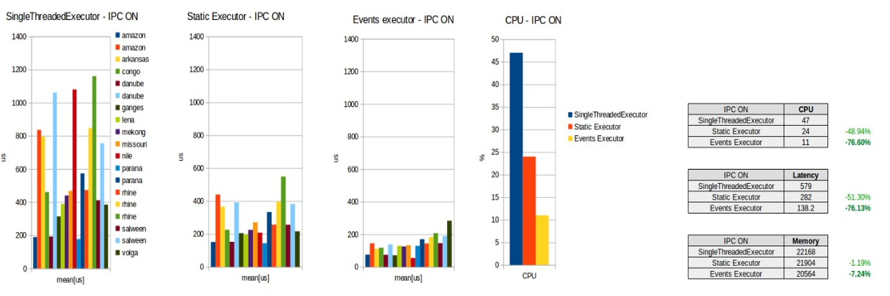

# events-executor

This repository contains a C++ implementation of the `EventsExecutor` designed by iRobot.
It is a new type of executor compatible with the ROS 2 `rclcpp` library.

The `EventsExecutor` design is based on the following principles:

 1. You don't pay for what you don't use.
 2. The abstractions between the application and the RMW should have minimal overhead.
 3. Extensibility.



The following data have been measured using the iRobot [ros2-performance](https://github.com/irobot-ros/ros2-performance) framework and show how, for a 10 nodes system, the `EventsExecutor` reduces both CPU and latency by 75% with respect to the default `SingleThreadedExecutor` and by 50% with respect to the `StaticSingleThreadedExecutor`.

These results have been obtained using the default implementation of the `EventsExecutor` events queue, i.e. an `std::queue`.
The extensibility of the `EventsExecutor` comes from the fact that this core components can be re-implemented by the users.
For example in this repository we also include an extension that uses a lock-free queue, based on this great [concurrent queue](https://github.com/cameron314/concurrentqueue) implementation. 
Other extensions would allow to bound the queue or enforce deterministic execution constraints.

## Instructions

This repository provides libraries that can be built/installed alongside a standard ROS 2 installation and give access to the `EventsExecutor` class and its related components.

To use the `EventsExecutor` you just need to build the `irobot_events_executor` project and add it as a dependency in your application.

The `irobot_lock_free_events_queue` is an optional package that provides access to a more performant implementation of the `EventsExecutor` events queue.
It also serves as an example of how the `EventsExecutor` can be customized and extended.

## Examples

The repository contains some example applications showing how to use the `EventsExecutor` in your application.

To build and run the examples you can do the following:

```
docker run -it osrf/ros:humble-desktop bash
sudo apt-get update && sudo apt-get upgrade && sudo apt-get install ros-humble-test-msgs
mkdir -p /root/ws/src
cd /root/ws/src
git clone https://github.com/irobot-ros/events-executor.git
cd ..
colcon build
source install/setup.sh
ros2 run events_executor_examples hello_events_executor
```

## rclcpp PRs

List of Pull Requests that are introducing the `EventsExecutor` in the ROS 2 core repositories.

#### Merged PRs

 - https://github.com/ros2/rclcpp/pull/1579
 - https://github.com/ros2/rcl/pull/839
 - https://github.com/ros2/rmw/pull/286
 - https://github.com/ros2/rmw_connextdds/pull/44
 - https://github.com/ros2/rmw_cyclonedds/pull/256
 - https://github.com/ros2/rmw_fastrtps/pull/468
 - https://github.com/ros2/rmw_implementation/pull/161

#### Open PRs

 - https://github.com/ros2/design/pull/305
 - https://github.com/ros2/rclcpp/pull/1891

## Known bugs and limitations

 - The `EventsExecutor` is not notified when a ROS 2 timer is reset.
